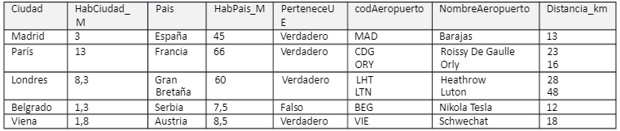
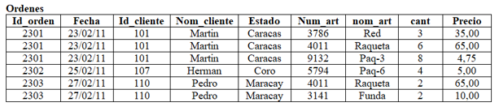

# Formas normales (hasta 3FN)

## Aeropuertos

### Tabla Aeropuertos

### Diagrama normalizado de la tabla aeropuertos

## Ordenes

### Tabla Ordenes

### Diagrama normalizado de la tabla ordenes

